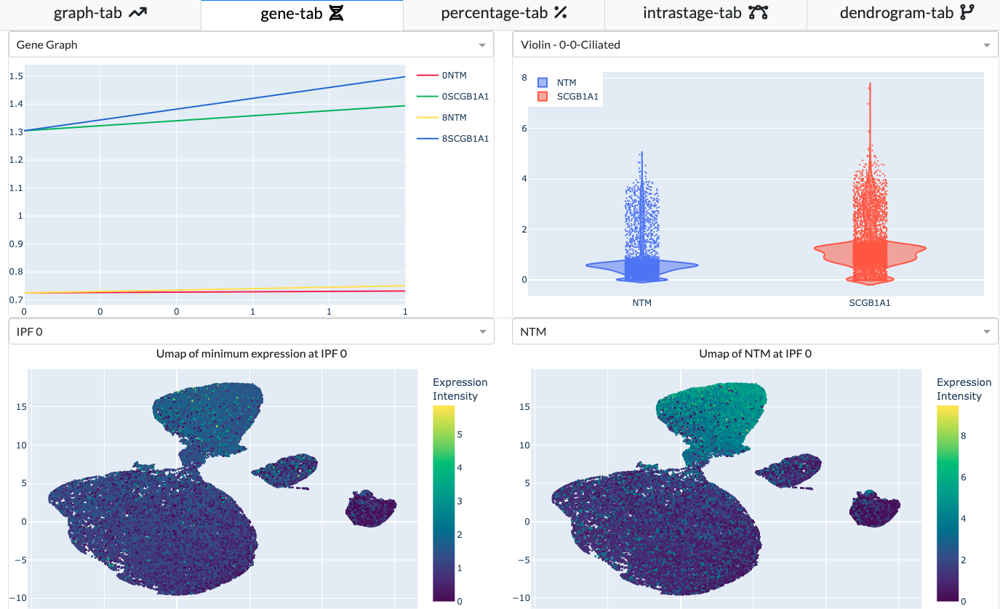

In Gene Tab, you can find the plots generated based on your cluster and gene selection. 
A tutorial on navigating the gene tab can be found [**here**](../../../tutorials/tutorial_3/).

    

## Heat Map

## Gene Graph

## Violin Plot

## Scatter Plot