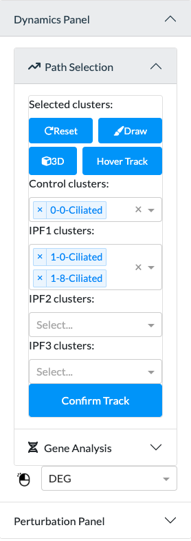

    
    

The dynamics panel contains two sub-panels and a dropdown menu: 
path selection, gene analysis, and display mode.

## Path Selection
Under Path Selection, you can select the clusters you want to investigate using the dropdown menus.
Once you select a control cluster, the clusters in IPF 1, 2, 3 will be automatically filled in.

After you finish selecting, click 'Confirm Track'.

A plot showing the relative percentage of cells in each stage and cluster will be shown in the percentage tab.

### Buttons
#### Reset
Click to reset your selections under the Path Selection panel.
#### Draw
Click to highlight the selected clusters in the 2D visualization of clusters in the graph tab.

  

#### 3D
Click to show the 3D visualization of how the maps of each IPF stage 
are connected. The selected track will be highlighted.
Click again to return the 2D visualization.

  

#### Hover Track
The default mode is enabled. When you hover upon a cluster in the 2D
visualization of clusters, a track will be highlighted. Click again to disable to hovering feature.

  

## Gene Analysis
### Buttons
#### Highlight
You can select genes in the dropdown menu. Click 'Highlight' to confirm your selection.
The genes will be highlighted in the 2D visualization of clusters in the [**Graph Tab**](analysis/graph_tab).
In a few seconds, a gene graph, a violin plot, and umap(s) of gene expression will be drawn in the gene tab. Details can be found in [**Gene Tab**](analysis/gene_tab).

    
    

#### Compare
You can select genes in the two dropdown menus. Click 'Compare' when you finish selecting.
In a few seconds, a table containing

    
    

## Display Mode

    

### DEG
The default display mode is DEG. Under DEG,