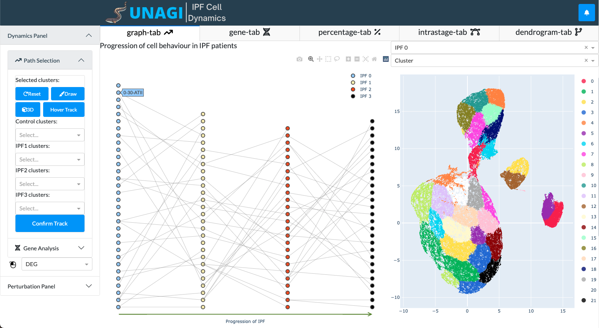
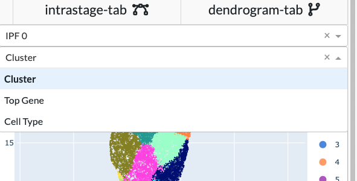
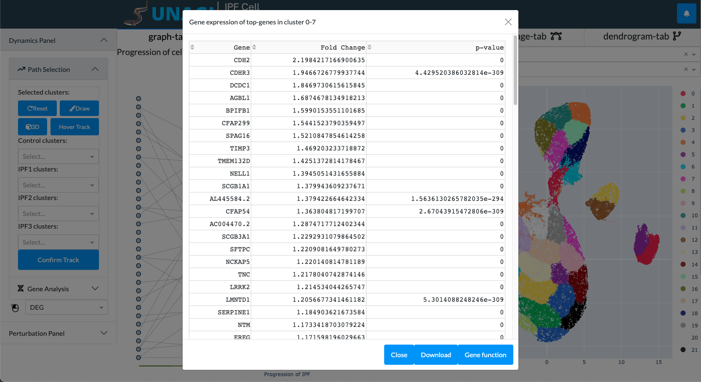
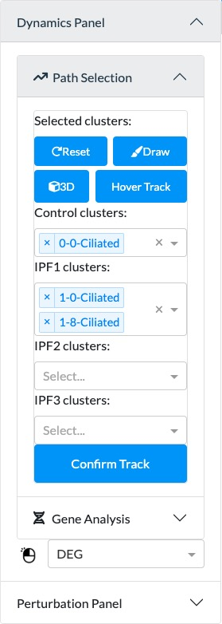
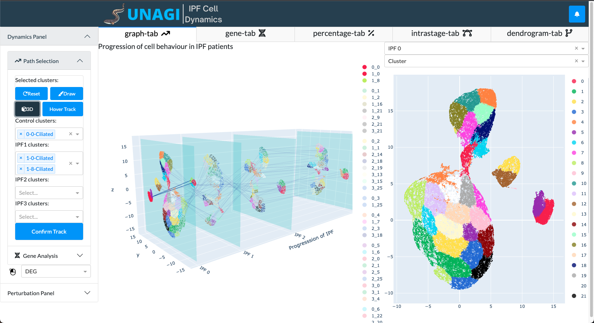
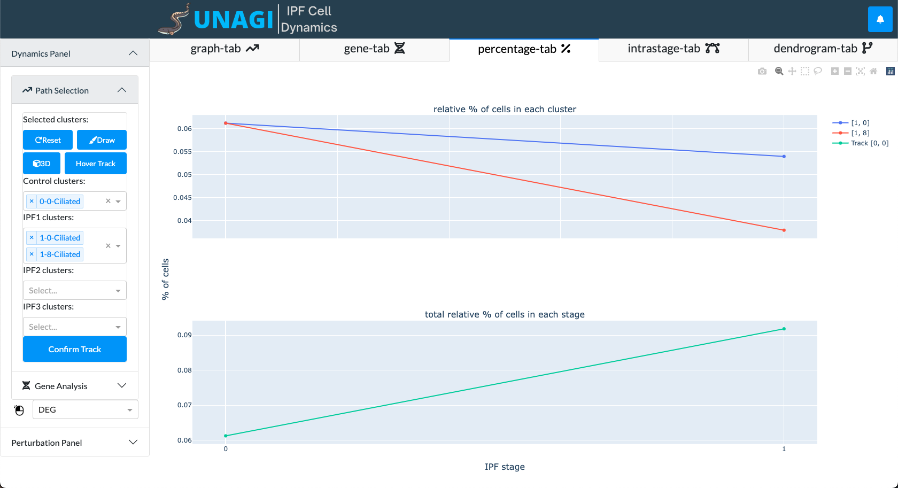

Tutorial - Basic Analysis Pipeline
---
This is a step by step demonstration of the basic functionalities of UNAGI.

UNAGI accepts .h5ad files and uses AnnData data structure for storing and analyzing. 

UNAGI can be viewed as two parts: two panels on the left side for clusters and genes selection and five tabs 
on the right side for results presentation. We are at the graph tab upon initialization. Inside graph tab, we have a
2D visualization of the tracks and a scatter plot colored by cluster types. The default coloring type of the scatter
plot is cluster, but we can use the dropdown menu to select different coloring options.

In the 2D visualization graph, each dot represents a cluster and each column represents a stage. We can click the dots
to view the gene expression of that cluster. The results are usually shown in 2s.

We can also select the track we want to analyze in the dynamics panel on the left.
If a control cluster is selected, the clusters for different stages will be automatically filled in. 
Once you have selected a track, click "Confirm Track" to confirm. After this, the scatter plot will be reloaded and
show the results of the selected clusters in a few seconds.

We can also click the "3D" button in the dynamics panel to view the 3D visualization. To go back, we can simply click 
"3D" again.

After selecting a track, we can go to the Percentage tab to see percentage of cells in each stage and in each cluster. 

In the gene panel, we can select two clusters to compare their gene expression. Click "compare"
after selecting two clusters and the results will be shown in a few seconds.

