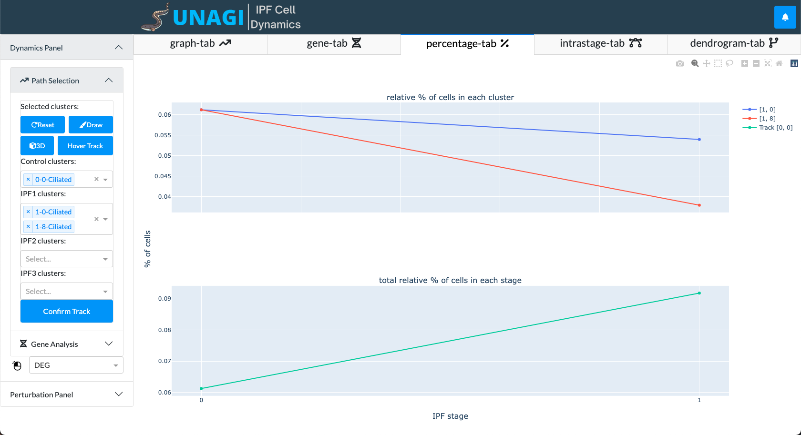

Tutorial - Explore Percentage Tab
---
First navigate to the Dynamics Panel in the sidebar. 
Under Path Selection, select the clusters you want to investigate using the dropdown menus.
Once you select a control cluster, the clusters in IPF 1, 2, 3 will be automatically filled in.

After you finish selecting, click 'Confirm Track'.

A plot showing the relative percentage of cells in each stage and cluster will be shown in the percentage tab.

    

